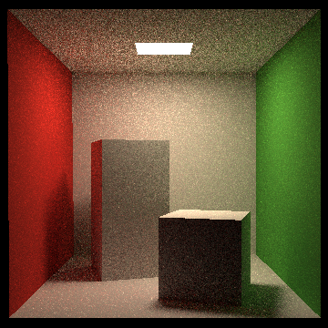
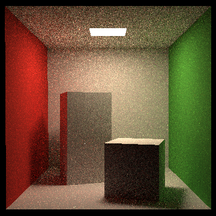

# Bidirectional Path Tracing

## Introduction

This program provides a detailed implementation of a fundamental paper in rendering, focusing on Bidirectional Path Tracing (BDPT). The whole project is written in pure C++ based on the architecture of path tracing assignment from GAMES101 by Prof. Lingqi Yan (UCSB).

Bidirectional Path Tracing (BDPT) is an advanced global illumination algorithm that combines the strengths of both path tracing and light tracing. In BDPT, paths are traced from both the camera (eye) and the light sources, and these paths are connected to form complete light transport paths. This method effectively handles complex lighting scenarios, including caustics and indirect lighting, by sampling light paths more effectively.

### Basic Principle

1. **Path Generation:**
    - Generate a path starting from the camera (eye path).
    - Generate a path starting from a light source (light path).

2. **Path Connection:**
    - Attempt to connect vertices between the eye path and the light path to form complete paths.

3. **Multiple Importance Sampling (MIS):**
    - Use MIS to weight the different paths based on their contribution to the final image, reducing variance and noise.

4. **Accumulation:**
    - Accumulate the contributions of all valid paths to determine the final pixel color.

### Pseudocode for BDPT

```pseudo
function BidirectionalPathTracing(scene, camera, lightSources, maxDepth):
    image = initialize_image(camera.resolution)
    
    for each pixel in image:
        radiance = vec3(0)
        
        for each sample:
            eyePath = generate_eye_path(camera, scene, maxDepth)
            lightPath = generate_light_path(lightSources, scene, maxDepth)
            
            for i in range(len(eyePath)):
                for j in range(len(lightPath)):
                    connection = connect_paths(eyePath[i], lightPath[j], scene)
                    
                    if is_valid_connection(connection, scene):
                        weight = MIS_weight(eyePath, lightPath, i, j)
                        radiance += weight * evaluate_path_contribution(eyePath, lightPath, connection)
        
        image[pixel] = radiance / num_samples
    
    return image
```

### Explanation

- **Eye Path Generation:** The camera emits rays into the scene, and each intersection with a surface is recorded, creating a path.

- **Light Path Generation:** Similarly, rays are emitted from light sources, and intersections are recorded.

- **Path Connection:** The key step where vertices from the eye and light paths are connected. The algorithm checks if this connection is valid (e.g., not blocked by other geometry).

- **MIS Weight:** Multiple Importance Sampling is used to give weights to different sampling strategies, reducing the noise by balancing the contribution from each path.

- **Path Contribution:** If the connection is valid, the contribution of the path is calculated by evaluating the material properties (BRDF) along the path.

## Example



*Figure 1: Bidirectional Path Tracing, spp = 25.*



*Figure 2: Path Tracing, spp = 25.*

For comparison, Figure 2 is generated by the Path Tracing algorithm, while Figure 1 is generated by the Bidirectional Path Tracing algorithm. Both images are rendered with 25 samples per pixel. Apparently, the Bidirectional Path Tracing algorithm can generate more realistic images with less noise.
## Tutorial

Create a build file folder in the directory:
```bash
mkdir build
```

Enter the build file folder:
```bash
cd build
```

Running cmake file:
```bash
cmake ..
```

Compile the project:
```bash
make
```

Run the project:
```bash
./BidirectionalPathTracing
```

An image file named `binary.ppm` would appear in the directory.

## Theory

### Mathematical Representation of the Equation

The solution to the equation can be mathematically expressed as:

$$ I_j=\int_{\Omega}f_j(\bar{x})d\mu(\bar{x}) $$

where $\bar{x}$ is the path from the eye to the light source, consisting of $k$ vertices, and $d\mu(\bar{x})$ is the area product measure. This value can be estimated using Monte Carlo sampling:

$$ f_j(\bar{x})=L_e(x_0\rightarrow x_1)G(x_0\leftrightarrow x_1)W_e^{j}(x_{k-1}\rightarrow x_{k})\prod_{i=1}^{k-1}f_s(x_{i-1}\rightarrow x_i\rightarrow x_{i+1})G(x_i\leftrightarrow x_{i+1}) $$

In Bidirectional Path Tracing (BDPT), $\bar{x}$ is sampled from both the light source and the eye/camera. Suppose for $\bar{x}$, obtained from a light subpath with $s$ vertices and an eye subpath with $t$ vertices, the corresponding sampling probability density function is:

$$ p_{s,t}(\bar{x})=p_s^L\cdot p_t^E\\ p_0^L=1,p_1^L=P_A(y_0),p_i^L=p_{\sigma^{\perp}}G(y_{i-2}\leftrightarrow y_{i-1}),i\geqslant 2\\ p_0^E=1,p_1^E=P_A(z_0),p_i^E=p_{\sigma^{\perp}}G(z_{i-2}\leftrightarrow z_{i-1}),i\geqslant 2\\ $$

where $y_i$ are vertices on the light subpath, and $z_i$ are vertices on the eye subpath.

Substituting this into the Monte Carlo sampling formula, the contribution of each sample is:

$$ \alpha_s^Lc_{s,t}\alpha_t^E=C_{s,t}\\ \alpha_0^L=1,\alpha_1^L=\frac{L_e^{(0)}(y_0)}{p_A(y_0)},\alpha_i^{L}=\frac{f_s(y_{i-3}\rightarrow y_{i-2}\rightarrow y_{i-1})}{p_{\sigma^{\perp}}(y_{i-2}\rightarrow y_{i-1})}\alpha_{i-1}^L,i\geqslant 2\\ \alpha_0^E=1,\alpha_1^E=\frac{W_e^{(0)}(z_0)}{p_A(z_0)},\alpha_i^{E}=\frac{f_s(z_{i-1}\rightarrow z_{i-2}\rightarrow z_{i-3})}{p_{\sigma^{\perp}}(z_{i-2}\rightarrow z_{i-1})}\alpha_{i-1}^E,i\geqslant 2\\ c_{0,t}=L_e(z_{t-1}\rightarrow z_{t-2})\\ c_{t,0}=W_e(y_{s-2}\rightarrow y_{s-1})\\ c_{s,t}=f_s(y_{s-2}\rightarrow y_{s-1} \rightarrow y_{t-1})G(y_{s-1}\leftrightarrow z_{t-1})f_s(y_{s-1}\rightarrow z_{t-1}\rightarrow z_{t-2}),s,t>0 $$

However, the above formula from Veach’s paper seems inconsistent with the formula for standard path tracing. To make both consistent, I made the following modifications:

$$ \alpha_i^{L}=\frac{f_s(y_{i-3}\rightarrow y_{i-2}\rightarrow y_{i-1})\cos\theta_{y_{i-2}\rightarrow y_{i-1}}}{p_{\sigma^{\perp}}(y_{i-2}\rightarrow y_{i-1})}\alpha_{i-1}^L,i\geqslant 2\\ \alpha_i^{E}=\frac{f_s(z_{i-1}\rightarrow z_{i-2}\rightarrow z_{i-3})\cos\theta_{z_{i-2}\rightarrow z_{i-1}}}{p_{\sigma^{\perp}}(z_{i-2}\rightarrow z_{i-1})}\alpha_{i-1}^E,i\geqslant 2 $$

### Multiple Importance Sampling (MIS)

Multiple Importance Sampling (MIS) is a technique used in rendering algorithms, including Bidirectional Path Tracing, to improve the efficiency of sampling light transport paths. It combines multiple sampling strategies by giving higher importance to paths that contribute more significantly to the final image, thereby reducing noise and improving convergence.

For a specific path of length $k$ ($k=s+t$), there are $k$ sampling strategies, where $t=1,2,...,k$. Each strategy has different noise characteristics. MIS determines which sampling strategy has less variance by assigning higher weights to samples with smaller variance.

Typically, samples with lower probability have higher variance. This heuristic aligns with efficient sampling of rare events. Therefore, the final weight for $C_{s,t}$ is:

$$ w_{s,t}=\frac{p^2_{s}}{\sum_{i=0}^{k-1}p_i^2} $$

where $p_i$ is the probability of sampling a path with $i$ vertices from the light subpath and $k-i$ vertices from the eye subpath. These weights can be computed relatively efficiently using the following equations:

$$ \frac{p_1}{p_0}=\frac{p_A(x_0)}{p_{\sigma^{\perp}}(x_1\rightarrow x_0)G(x_1\leftrightarrow x_0)}\\ \frac{p_{i+1}}{p_i}=\frac{p_{\sigma^{\perp}}(x_{i-1}\rightarrow x_i)G(x_{i-1}\leftrightarrow x_i)}{p_{\sigma^{\perp}}(x_{i+1}\rightarrow x_i)G(x_{i+1}\leftrightarrow x_i)},i=1,...,k-1 $$

### Sampling on the Light Source

In unidirectional path tracing, we start from the camera, but in Bidirectional Path Tracing, we also need to sample an initial point and initial ray from the light source. Here is a brief description of how to sample the light source:

1. **Uniformly select a light source** in the scene.
2. **Sample a point on the surface of the light source** as the initial vertex of the light subpath with a probability density function (PDF) $p_A(y_0)$.
3. **Sample a direction** for the initial ray with PDF $p(y_0\rightarrow y_1|y_0)$.

For instance, in the case of an area light source:

1. **Randomly select a point** on the area light source. Set $p_A(y_0)$ to $\frac1A$, where $A$ is the area of the light source.
2. **Sample the direction** using a cosine-weighted hemisphere sampler and set the corresponding probability density function to $p(y_0\rightarrow y_1|y_0)$.

### Sampling on the Camera

For simplicity, only the pinhole camera model is considered, as lens models require complex sampling.

For sampling eye vertices, there are two cases that need different handling:

1. **Standard case**: We generate the eye subpath from the initial eye vertex. Since we uniformly sample from the image plane corresponding to pixel $I_j$, we set $p_A(z_0)=1$ and $p(z_0\rightarrow z_1|z_0)=1$.
2. **Special case**: This requires more complex handling. When connecting a light subpath with only one vertex to an eye subpath, the corresponding ray may not contribute to pixel $I_j$. To efficiently utilize this sample, we need to sample another eye vertex and update the contribution to the pixel in the light map. To do so, we need to find $f_s(z_1\rightarrow z_0\rightarrow z_{-1})=W^{(1)}_e(z_0,\omega)$ such that:

$$ \int_D W_e^{(1)}(z_0,\omega)d\sigma^{\perp}(\omega) $$

equals the proportion of the image area covered by the point $(u, v)$ mapped by the lens to direction $\omega\in D$.

Although the computation is complex (honestly, I don't know how to compute it), fortunately, the book "Physically Based Rendering: From Theory to Implementation" provides the computation result for the pinhole camera. The final result is $\frac{(1,1,1)}{A\cdot\cos^4\theta}$, where $A$ is the physical plane size corresponding to a $1\times 1$ image plane, and $\theta$ is the

angle between the ray and the normal at the eye point (for the pinhole model, it is the camera's direction). The corresponding probability density function for the ray direction is $\frac{d^2}{\cos\theta}$, where $d$ is the distance between the eye point and the next point on the path.

## Notice

This project is still under development. More features might be added in the future. And there might be still some bugs in the implementation of the BDPT algorithm.

- In this project, I only consider the diffuse surface and reflection. Therefore, only Lambertian BRDF is used in the implementation. 
- In the standard path tracing algorithm, I use the Russian Roulette technique to terminate the path. However, in the BDPT algorithm, I use the path length to terminate the path and Russian Roulette is not taken into consideration.
- In the standard path tracing algorithm, I sampled the light source to obtain the direct illumination, which increase the probability of direct illumination. So, the results of standard path tracing might be better than those of some traditional implementations.

## References

1. Veach E. "Robust Monte Carlo Methods for Light Transport Simulation," Ph.D. thesis, Stanford University Department of Computer Science, 1998.
2. Arvo, J. "Analytic Methods for Simulated Light Transport," Ph.D. thesis, Yale University, 1995.
